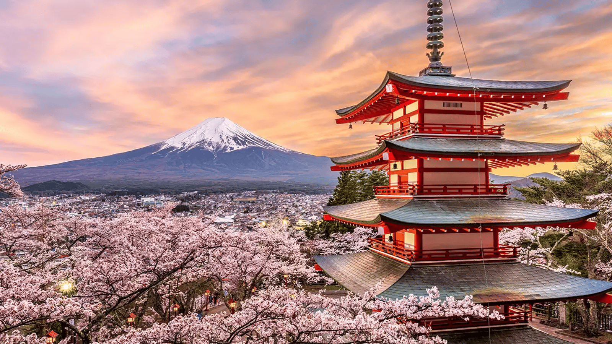

# Image Segmentation using Disjoined Set Union (DSU)

This program segments an image based on color similarity using DSU. It first converts the image to grayscale, applies a Gaussian blur, and then identifies connected components of pixels with the same quantized color. Finally, it filters these components, coloring the largest area and any very small areas black, while assigning random colors to other significant areas.

The `lodepng.c` and `lodepng.h` files for PNG image decoding/encoding are included in this repository.

## How to Compile and Run

This project includes a `Makefile` for easy compilation.

1.  **Compile:**
    Navigate to the project's root directory in your terminal and simply run:

    ```bash
    make
    ```
    This will use the provided `Makefile` to compile the program. The default executable name defined in the `Makefile` as 'bigtask'.

2.  **Run:**
    The program takes two arguments: the input PNG file and the desired output PNG file name.

    ```bash
    ./bigtask input.png output.png
    ```

3.  **Clean (optional):**
    To remove compiled object files and the executable, you can run:
    ```bash
    make clean
    ```

## Examples of Work

Here are a few examples demonstrating the program's output. The "output" images show the segmentation result where:
*   The largest identified area is colored black.
*   Areas smaller than a certain threshold (currently 0.1% of the total image area, adjustable in the source code) are also colored black.
*   Other significant areas are assigned distinct random colors.

---

### Fennec Fox

**Original (`Examples/fennec.png`):**


**Segmented Output (`Examples/fennec_output.png`):**


---

### Japanese Scenery

**Original (`Examples/japan.png`):**


**Segmented Output (`Examples/japan_output.png`):**


---

### Milky Way

**Original (`Examples/milkyway.png`):**


**Segmented Output (`Examples/milkyway_output.png`):**


---

### MRI Scan

**Original (`Examples/mri.png`):**


**Segmented Output (`Examples/mri_output.png`):**


---

### Snowflake

**Original (`Examples/snowflake.png`):**


**Segmented Output (`Examples/snowflake_output.png`):**


---

## How it Works (Briefly)

1.  **Load Image**: Decodes the input PNG image using the included `lodepng` library.
2.  **Grayscale**: Converts the image to grayscale.
3.  **Blur**: Applies a 5x5 Gaussian blur to the grayscale image. The pixel values are then quantized.
4.  **MST Components**: Builds a representation where each pixel is a node. Pixels with the same quantized color in a 5x5 neighborhood mask are merged into the same component using a Disjoint Set Union (DSU) structure. Each root of a DSU tree is assigned a random color.
5.  **Filter & Recolor**: 
    *   Identifies the component (root node) with the largest number of pixels.
    *   Colors all pixels belonging to this largest component black.
    *   Colors all pixels belonging to components smaller than 0.1% (adjustable in the source code) of total pixels black.
    *   Pixels belonging to other components retain the random color assigned to their root.
6.  **Save Image**: Encodes the processed image buffer to an output PNG file using `lodepng`.